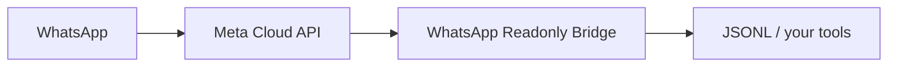

# WhatsApp Readonly Bridge

Receive inbound WhatsApp messages through Meta's official Cloud API and route them into tools you control, without WhatsApp Web or session scraping.

Inbound webhook events are validated, normalized, and appended to local JSONL. Optional Telegram, Discord, reader, stats, and local API examples consume that file outside the core bridge.

[](https://github.com/MarketingBoer/whatsapp-readonly-bridge/releases)
[](https://github.com/MarketingBoer/whatsapp-readonly-bridge/actions/workflows/ci.yml)
[](https://github.com/MarketingBoer/whatsapp-readonly-bridge/pkgs/container/whatsapp-readonly-bridge)
[](https://www.python.org/)
[](LICENSE)



## Quick Start

```bash
git clone https://github.com/MarketingBoer/whatsapp-readonly-bridge.git
cd whatsapp-readonly-bridge
cp .env.example .env
chmod 0600 .env
$EDITOR .env
docker compose up -d
curl http://127.0.0.1:3100/health
```

Set both required values before startup:

- `WA_VERIFY_TOKEN`: a random value you choose and enter in Meta's webhook verification form.
- `WA_APP_SECRET`: the Meta app secret used to validate `X-Hub-Signature-256`.

Neither value is a WhatsApp access token.

Pull the published image directly:

```bash
docker pull ghcr.io/marketingboer/whatsapp-readonly-bridge:latest
```

For local image builds:

```bash
WA_VERIFY_TOKEN=dummy WA_APP_SECRET=dummy docker compose -f docker-compose.yml -f docker-compose.build.yml up --build
```

## Meta prerequisites

You need a Meta app with WhatsApp Business Platform Cloud API access, a public HTTPS callback URL, the app secret, and a webhook subscription for the WhatsApp Business Account `messages` field.

Register one accepted callback path, usually `/webhook`; `/webhook/whatsapp-cloud` is retained for backwards-compatible deployments. Meta verifies the endpoint with your chosen `WA_VERIFY_TOKEN`; signed POST requests are then validated with `WA_APP_SECRET`.

Official Meta references:

- [Webhook endpoint validation and signatures](https://developers.facebook.com/documentation/business-messaging/whatsapp/webhooks/create-webhook-endpoint)
- [Webhook retries, duplicates, payloads, and fields](https://developers.facebook.com/documentation/business-messaging/whatsapp/webhooks/overview)
- [Pricing](https://developers.facebook.com/documentation/business-messaging/whatsapp/pricing)
- [Business App Coexistence onboarding](https://developers.facebook.com/documentation/business-messaging/whatsapp/embedded-signup/onboarding-business-app-users)

## Configuration

| Variable | Default | Notes |
|---|---:|---|
| `WA_VERIFY_TOKEN` | none | Required; placeholders are rejected |
| `WA_APP_SECRET` | none | Required; placeholders are rejected |
| `WA_BIND` | `127.0.0.1` | Compose sets `0.0.0.0` inside the container |
| `WA_PORT` | `3100` | `1..65535` |
| `WA_INBOX` | `./inbox/messages.jsonl` | Relative to the process working directory |
| `WA_WEBHOOK_PATH` | `/webhook` | Also accepts `<path>/whatsapp-cloud` |
| `WA_LOG_LEVEL` | `INFO` | Standard Python levels |
| `WA_STORE_RAW` | `true` | `false` keeps `raw: null` |
| `WA_REQUEST_TIMEOUT` | `10` | Seconds, `1..60` |
| `WA_SHUTDOWN_TIMEOUT` | `15` | Seconds, `1..60` |

Direct Python uses the tested `.env` loader:

```bash
cp .env.example .env
chmod 0600 .env
$EDITOR .env
python3 bridge.py
```

## Docker

`docker-compose.yml` uses `ghcr.io/marketingboer/whatsapp-readonly-bridge:latest`, binds to `127.0.0.1:3100` by default, requires both secrets, and stores data in a named `/data` volume.

## systemd

`whatsapp-bridge.service` is a hardened example for direct Python installs. Create `/etc/whatsapp-readonly-bridge.env` as root-owned mode `0600` with `WA_VERIFY_TOKEN` and `WA_APP_SECRET`, place the project under `/opt/whatsapp-readonly-bridge`, and run it behind a TLS reverse proxy or tunnel. Meta requires a publicly trusted HTTPS callback URL.

## Architecture

`bridge.py` owns configuration, HTTP transport, request limits, logging, and lifecycle. `whatsapp_webhook.py` validates signatures and normalizes payloads. `jsonl_store.py` performs single-node JSONL append, startup ID scanning, retry deduplication, and tolerant reads.

Stable record schema:

```json
{
  "ts": "2026-08-14T14:00:00+00:00",
  "message_id": "wamid.example",
  "message_timestamp": "2026-08-14T13:59:58+00:00",
  "from": "31600000000",
  "name": "Example Contact",
  "type": "text",
  "text": "Hello",
  "phone_number_id": "123456789",
  "raw": null
}
```

## Examples

- `python3 reader.py --json` prints JSONL records for automation, AI agents, dashboards, or CRM import jobs.
- `python3 stats.py --json` summarizes local inbox activity.
- `python3 digest.py --dry-run` formats a periodic Telegram summary without network calls.
- `python3 examples/discord-webhook.py --dry-run` formats a periodic Discord summary without network calls.
- `python3 examples/api-server.py` exposes a loopback-only unauthenticated local JSON API example.

Telegram and Discord examples are periodic summaries. They are not real-time delivery guarantees.

Sample files:

- [examples/sample-inbox.jsonl](examples/sample-inbox.jsonl)
- [examples/telegram-digest-example.txt](examples/telegram-digest-example.txt)

## Security and privacy

Accepted-path POST requests require `X-Hub-Signature-256` before JSON parsing. The bridge has no WhatsApp Graph send/reply call and no WhatsApp access-token configuration.

JSONL records can contain phone numbers, names, message summaries, timestamps, and optionally raw message objects. `WA_STORE_RAW=false` reduces retained raw data but is not anonymization. Operators remain responsible for retention, access control, backups, Meta policy, privacy, security, and applicable law.

The Telegram and Discord examples do make outbound requests to those services. They are outside the inbound-only bridge boundary.

See [SECURITY.md](SECURITY.md).

## Pricing

Meta's current pricing documentation distinguishes message categories and says user-to-business messages are not charged in the referenced Cloud API pricing model. Hosting, tunnels, logging, backups, and downstream services may still cost money, and Meta pricing can change.

## Coexistence

Meta documents Business App Coexistence as an onboarding path with eligibility requirements and limitations. Treat it as a Meta account/product condition to verify for your number, not as a universal property of this repository.

## Limitations

- No WhatsApp sending or replying.
- No media binary download.
- No browser UI, shared inbox, campaign tool, or chatbot framework.
- Practical single-process retry deduplication, not transactional exactly-once delivery.
- One bridge process per inbox for v1.
- The local API example has no authentication.

## FAQ

**Can this reply on WhatsApp?** No. The core bridge has no send/reply path.

**Can tools consume the inbox?** Yes. Use JSONL directly or `reader.py --json`.

**Does it remove compliance work?** No. Self-hosting and official webhooks do not remove operator obligations.

**Can I use Telegram or Discord?** Yes, via optional examples that send periodic summaries to those services.

## Contributing

See [CONTRIBUTING.md](CONTRIBUTING.md). Keep v1 focused on signed inbound webhooks, JSONL storage, and optional downstream readers.

## Security

Report private issues according to [SECURITY.md](SECURITY.md). Do not put real secrets, phone numbers, names, or message bodies in issues, tests, or launch material.

## License

[MIT](LICENSE)
